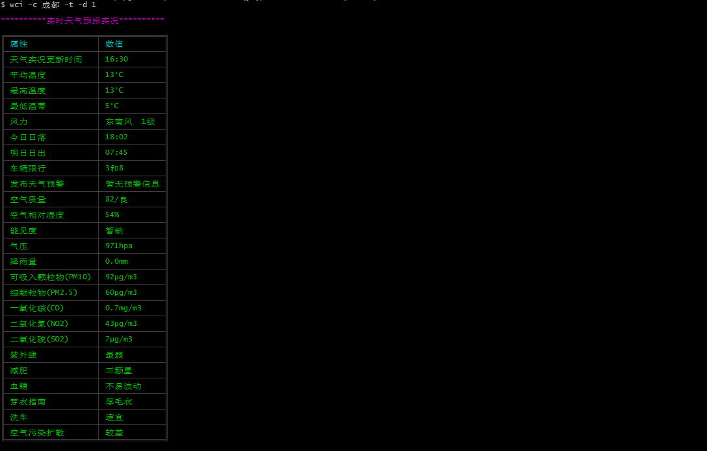
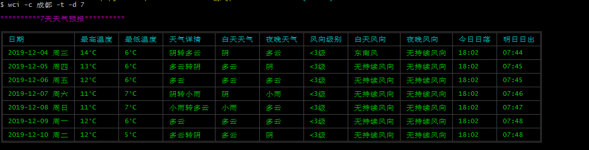
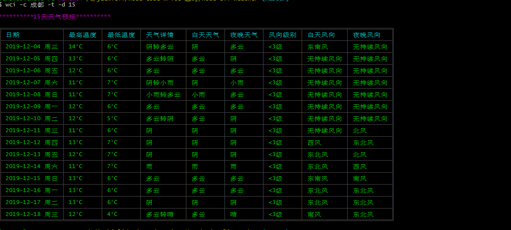
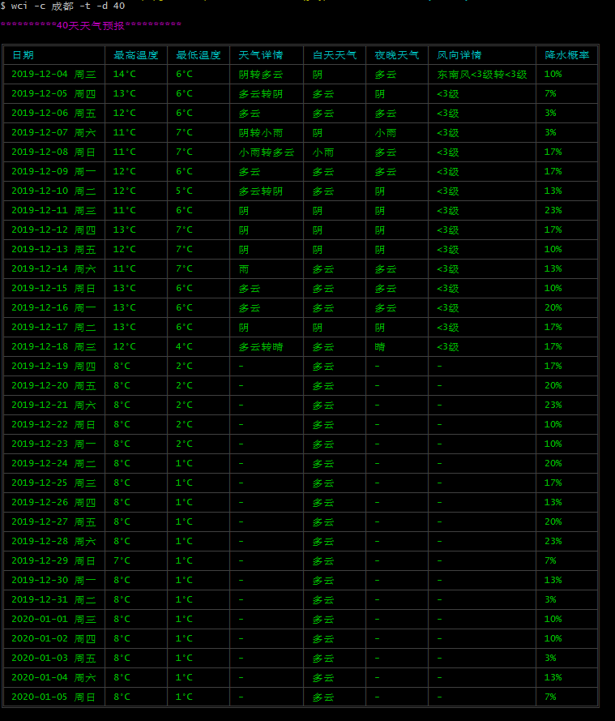

## 天气预报cli 工具 

- cli开发的数据来源[中国天气网](http://www.weather.com.cn/)

## 使用方法 

```
npm i wci-cli-tool
```

```
weather -h 
weather -c 成都 -t -d 1 
weather -c 成都 -j -d 1 --hourly
weather -c 成都 -t -d 7 --hourly --date 11-11
weather -c 成都 -t -d 15
weather -c 成都 -t -d 40 
```

```
$ weather -c 成都 -t -d 1

**********实时天气预报实况**********

╔════════════════════╤══════════════╗
║ 属性               │ 数值         ║
╟────────────────────┼──────────────╢
║ 天气实况更新时间   │ 19:25        ║
╟────────────────────┼──────────────╢
║ 平均温度           │ 9°C          ║
╟────────────────────┼──────────────╢
║ 最高温度           │ 13°C         ║
╟────────────────────┼──────────────╢
║ 最低温蒂           │ 6°C          ║
╟────────────────────┼──────────────╢
║ 风力               │ 静风 0级     ║
╟────────────────────┼──────────────╢
║ 今日日落           │ 18:02        ║
╟────────────────────┼──────────────╢
║ 明日日出           │ 07:45        ║
╟────────────────────┼──────────────╢
║ 车辆限行           │ 3和8         ║
╟────────────────────┼──────────────╢
║ 发布天气预警       │ 暂无预警信息 ║
╟────────────────────┼──────────────╢
║ 空气质量           │ 87/良        ║
╟────────────────────┼──────────────╢
║ 空气相对湿度       │ 88%          ║
╟────────────────────┼──────────────╢
║ 能见度             │ 4.8km        ║
╟────────────────────┼──────────────╢
║ 气压               │ 974hpa       ║
╟────────────────────┼──────────────╢
║ 降雨量             │ 0.0mm        ║
╟────────────────────┼──────────────╢
║ 可吸入颗粒物(PM10) │ 98μg/m3      ║
╟────────────────────┼──────────────╢
║ 细颗粒物(PM2.5)    │ 64μg/m3      ║
╟────────────────────┼──────────────╢
║ 一氧化碳(CO)       │ 0.8mg/m3     ║
╟────────────────────┼──────────────╢
║ 二氧化氮(NO2)      │ 62μg/m3      ║
╟────────────────────┼──────────────╢
║ 二氧化硫(SO2)      │ 7μg/m3       ║
╟────────────────────┼──────────────╢
║ 紫外线             │ 最弱         ║
╟────────────────────┼──────────────╢
║ 减肥               │ 三颗星       ║
╟────────────────────┼──────────────╢
║ 血糖               │ 不易波动     ║
╟────────────────────┼──────────────╢
║ 穿衣指南           │ 厚毛衣       ║
╟────────────────────┼──────────────╢
║ 洗车               │ 适宜         ║
╟────────────────────┼──────────────╢
║ 空气污染扩散       │ 较差         ║
╚════════════════════╧══════════════╝

```

## 当天

!

#### 未来7天

!

#### 未来15天

!

#### 未来40天

!


